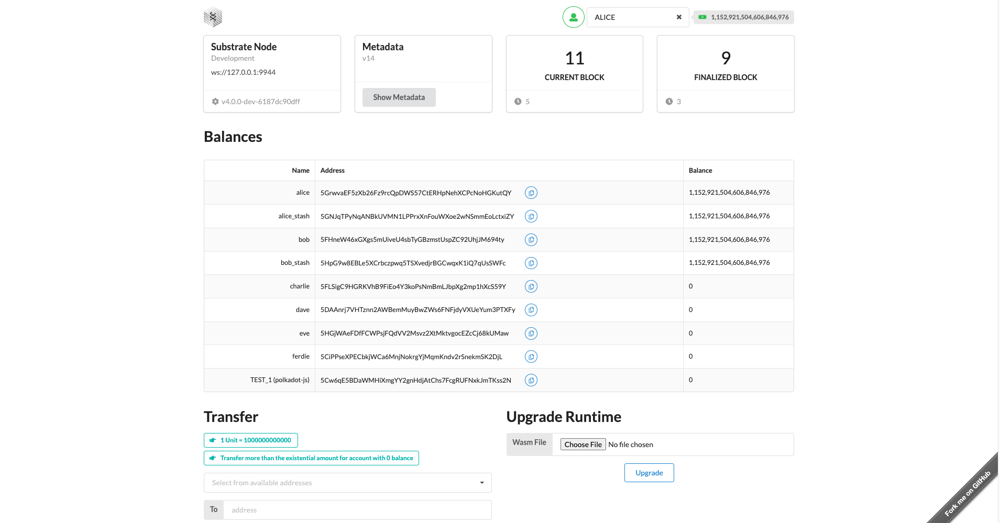
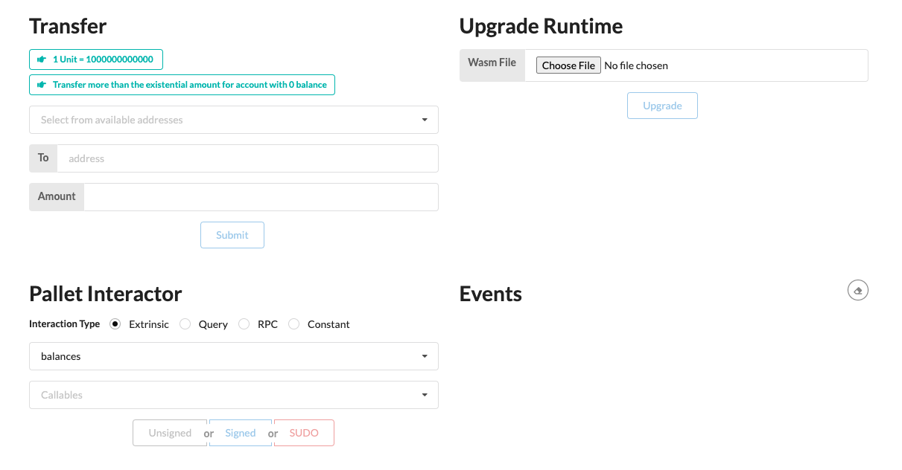
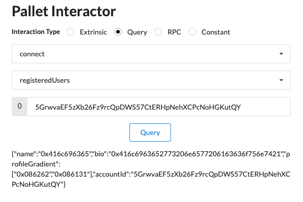

With your node running, now would be a good idea to launch the frontend template from the previous module.  This will allow you to interact with the node on a basic level, while also accessing different functionality through the various pallets, including our custom `connect` pallet.'

:::info Launch the frontend template

Make sure your node and the frontend template is running:

```bash
cd substrate-frontend-template/
yarn start
```

:::

## Quick tour

Located at `http://localhost:8000/substrate-frontend-template`, you should be greeted with this page (as seen previously).  It shows various network statistics regarding your node:




Using this template, we can also interact with our node using the **pallet interactor**.  Be sure to have the **ALICE** account selected, as it is pre-funded for sending extrinsics:


## Registering a user with the Pallet Interactor

The bottom half of the frontend template features the ability to perform forkless upgrades, the pallet interactor, and an event viewer:



We will be using the **pallet interactor** to register a new user to the network.  Select the drop down, and select our pallet `connect`, then in the second dropdown, our `register` extrinsic.  You'll notice two parameters: the name and bio, which are filled accordingly with text:


Once all parameters are filled, select `Signed`.  This will send the transaction, or extrinsic to be confirmed in a block within our node.

Notice the event view immediately emits several events indicating that our registration was a success.  The user has been registered, the balance locked, and stored within state.


Later, you should also see this below the pallet interactor, indicating that the state change has been finalized by the network:


:::info What is signed, unsigned, and SUDO?

These three buttons represent different **origins** for the extrinsic.  If you remember within our pallet, we used the macro `ensure_signed` to indicate that we expect a signed extrinsic.

:::


## Querying state

To query state, make sure to select "Query" as the interaction type:


As before, select the `connect` pallet, and enter the name "Alice" to query the user metadata for Alice, and hit "Query":



Congratulations, our custom pallet works!